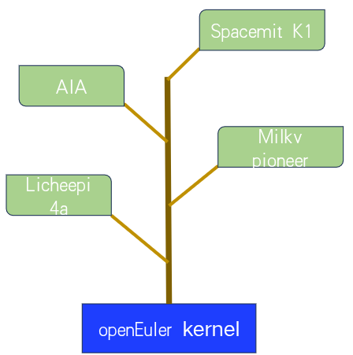

# openEuler RISC-V 内核同源项目

## 简介

当前各 RISC-V SoC 厂商分别维护不同的内核版本，难以满足 openEuler 对统一内核的要求。这种差异导致基于不同开发板的系统镜像内核不一致，增加维护复杂度并削弱生态协同。由于现有厂商内核版本与 openEuler 24.03 发布的 kernel 6.6 较为接近，实现统一适配的技术难度较低。在此背景下，openEuler RISC-V SIG 发起 RISC-V Common Kernel（RVCK）方案，旨在促使各方协同构建统一内核基础，以降低维护成本、优化生态拓展并增强社区整体影响力。

## 开发树构型

开发树的根基于openEuler kernel的OLK-6.6分支，顶部为主流riscv硬件平台支持补丁。开发树会定期以rebase方式进行滚动，滚动的过程是先导出合并的riscv硬件平台支持补丁，然后回退到根，执行git pull拉取openEuler kernel最新状态，之后重新移植前面导出的所有补丁，进行集成测试。

### 已经合并的平台

| 厂商     | SOC    | 开发板         |
| -------- | ------ | -------------- |
| 算能     | SG2042 | Milk-V Pioneer |
| 平头哥   | TH1520 | LicheePi 4A    |
| 进迭时空 | K1     | Key Stone K1   |

## 贡献过程

虚线框内为rvck-olk项目的范畴，左边是厂商的代码，右边对接openEuler主线内核仓库。大致贡献过程是，

* 厂商首先整理代码，主要是通过checkpatch.pl测试和剔除商业代码；
* 新建一个issue;
* 发起pull requests并关联issue；
* 补丁通过oervci自动化测试；
* 人工审核代码是否符合rvck规范并确保代码质量；
* 最后合并进rvck-olk仓库的OLK-6.6分支；
* 稳定后我们会release至src发版仓库，该仓库为openEuler OS打包仓库；
* 我们会安排专业的工程师将合并的的补丁集提交到openEuler主线内核OLK-6.6分支。
